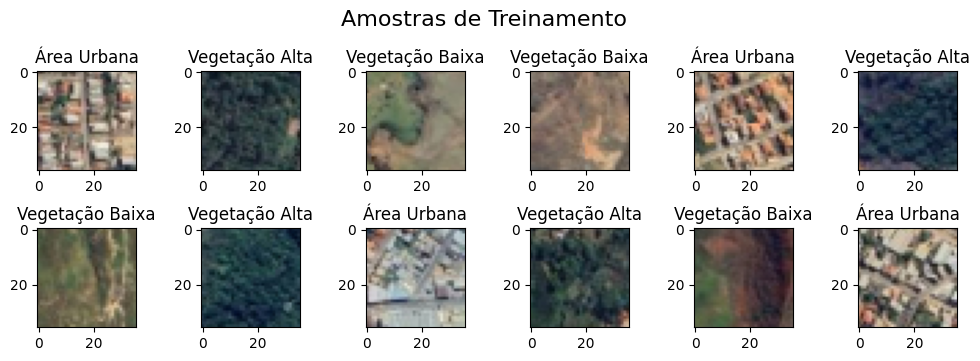
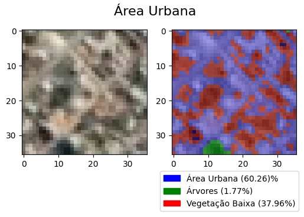
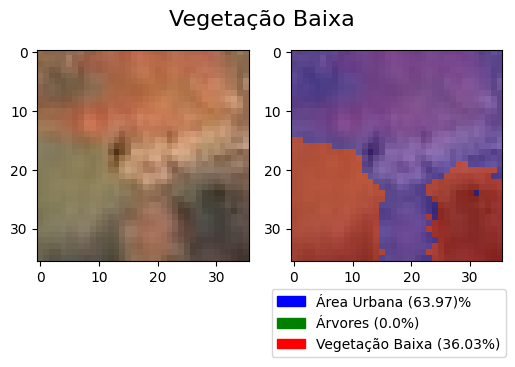
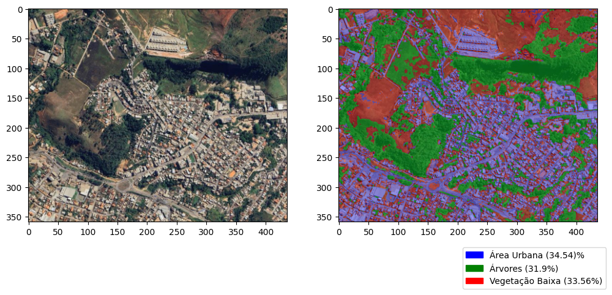
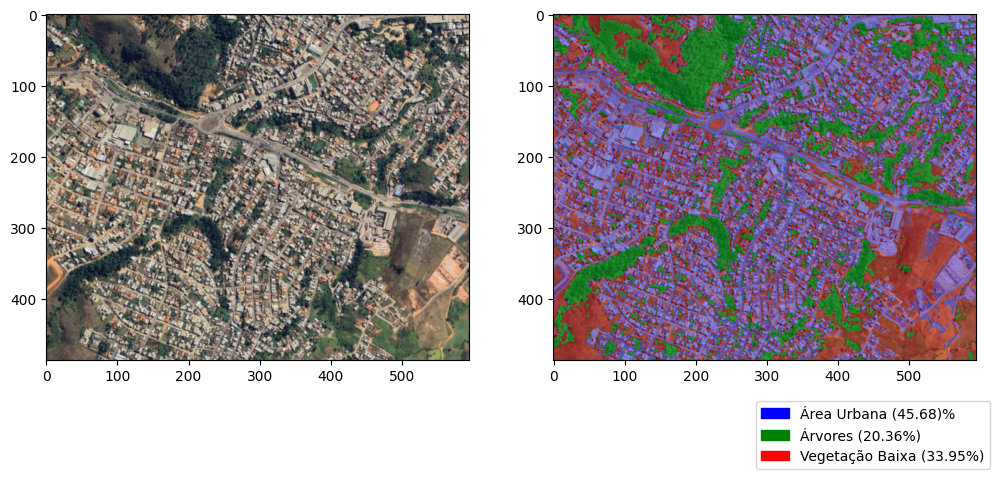

# Classificação de mapas com Naive Bayes

Esta implementação apresenta uma aplicação prática do algoritmo de aprendizagem generativa Naive Bayes na classificação/categorização de regiões em imagens de satélite (mapas).

 

## Classificador Bayesiano

O Classificador Bayesiano é dado pela **função discriminante $dj(x)$** :

$d_j(x)$ = $\ln{[p(x/\omega_j) P(w_j)]}$, onde:

 - $j$ é a classe $\in$ Classes existentes.
 - $x$ é a amostra de entrada ( que será classificada ).
 - $w_j$ é o conjunto de amostras conhecidas pertencentes à classe $j$.
 - $P(w_j)$ é a probabilidade à priori de que uma amostra aleatória pertença a classe $j$.
 - $p(x/\omega_j)$ é a probabilidade condicional das características da amostra de entrada x pertencer a classe $j$, que por sua vez é dado por:

    $p(x/\omega_j) = - \frac{1}{2} \ln|C_j| - \frac{1}{2}[(x - M_j)^t C_{j}^{-1}(x - M_j)]$, onde:

     - $M_j = \frac{1}{N_j} \sum_{x \in w_j} x$,  o vetor médio da classe $j$.
     - $C_j = \frac{1}{N_j} \sum_{x \in w_j} xx^t - M_jM_{j}^{t}$, a matriz de covariâncias da classe $j$.
     - $|C_j|$, determinante da matriz de covariâncias da classe $j$.
     - $C_{j}^{-1}$, inversa da matriz de covariâncias da classe $j$.

Desta forma, dadas as classes possíveis $j \in W$, submetemos uma amostra desconhecida $x$ a função discriminante para cada $j$.

Exemplo:
 
  - Assumindo como classes possíveis $W = \{ a, b, c \}$ e uma amostra desconhecida $x$

  - A classificação de $x$ é dada por: $\arg\max[ d_a(x), d_b(x), d_c(x) ]$

  
## Escopo da implementação

Os mapas são extraídos a partir de imagens de cidades ou regiões do Google Earth ou Google Maps.

O objetivo é identificar nos mapas as seguintes classes:
 
 - Área urbana
 - Vegetação baixa
 - Vegetação alta

As amostras são definidas pelos pixels das imagens. Cada pixel possui 3 atributos (RGB) e estes são as features de cada amostra.

## Estimando parâmetros com dados de treinamento.

Para definir a função discriminate do classificador é necessário obter as médias $Mj$ e a matriz de covariâncias $C_j$ de cada classe. Estes parâmetros são obtidos a partir das amostras de treinamento do modelo.

No contexto desta aplicação, um conjunto de amostras de treinamento é obtido a partir dos pixels de uma imagem **contendo apenas elementos de sua respectiva classe**. Cada pixel deve ser associado a sua respectiva classe.

#### Amostras utilizadas para o treinamento/ajuste dos parâmetros

## Availiação parcial do modelo de classificação.

Para uma avaliação parcial do modelo, foram utilizadas amostras rotuladas de validação (amostras separadas do pool de treinamento).

#### Amostras utilizadas para a validação

### Matriz de confusão com dados de validação

Também é interessante visualizar como o modelo classifica cada pixel nas amostras de validação. Pode ser util para avaliar qualidade das amostras de treinamento, assim como elaborar métodos de pré-processamento que possam auxiliar na distinção entre as *features* de cada classe.

#### Classificação das amostras de validação

 

## Classificando mapas
A classficiação é feita pixel a pixel, e por tanto a imagem de entrada deve ser carregada na estrutura adequada (vetor coluna de pixels).

A melhor forma de vizualizar o resultado da classificação gerar nova imagem de saída com as mesmas dimensões da entrada, e atribuir cores específicas acordo com a classificação do pixel.

Como saída bruta obtemos uma imagem contendo apenas pixels com a cor de cada classe.

A partir daí uma sobreposição com transparência pode ser aplicada à imagem original de entrada facilitando a visualização das regiões classificadas.

#### Resultados
 
 
 
 
## Referências

Esta implementação foi elaborada com base nas aulas e material disponibilizados na disciplina CSI707: Aprendizagem de Máquina - UFOP - ICEA, pelo professor Eduardo da Silva Ribeiro.

